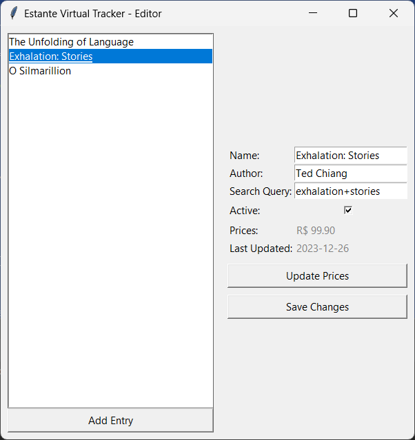

# Estante Virtual Tracker
> A tracker for book prices on the brazilian second-hand virtual store, Estante Virtual 


## How do I use this?

First of all, clone the repository on your computer. Then, install the dependencies:

```bash
pip install -r requirements.txt
```

Now, you'll need to create a bot on Telegram and get its token. Then, create a file called `tokens.py` and paste the token there, like this:

```python
BOT_API_TOKEN = '<your token>'
CHAT_ID = '<your chat id>'
```

Next, run `editor.py` to add the books you want to track. This will modify the `data/database.json` file, which you can also edit by hand if that is what you prefer.

Finally, run `main.py` whenever you want. This updates prices and notifies the user via Telegram whenever a new low price is found. Ideally, you'll set up `main.py` to run via cronjob or something of the sort.

Please don't run it every 5 minutes. Be polite. I'm running it every day and it gives me ample time to get the books I need.

## Haven't you already made this?

Yeah, I've made this exact project like 2 times before (using Gmail instead of Telegram Bots), but this time I wanted to use it as a benchmark so I could gauge how ChatGPT 3.5 would fare on the task.
The result: 2 hours (1 hour for me to figure out the Telegram bot part, and 1 hour for the rest). Scary! But useful. Besides, if it allows me to spend less time writing Tkinter screens, I'm not going to complain!

